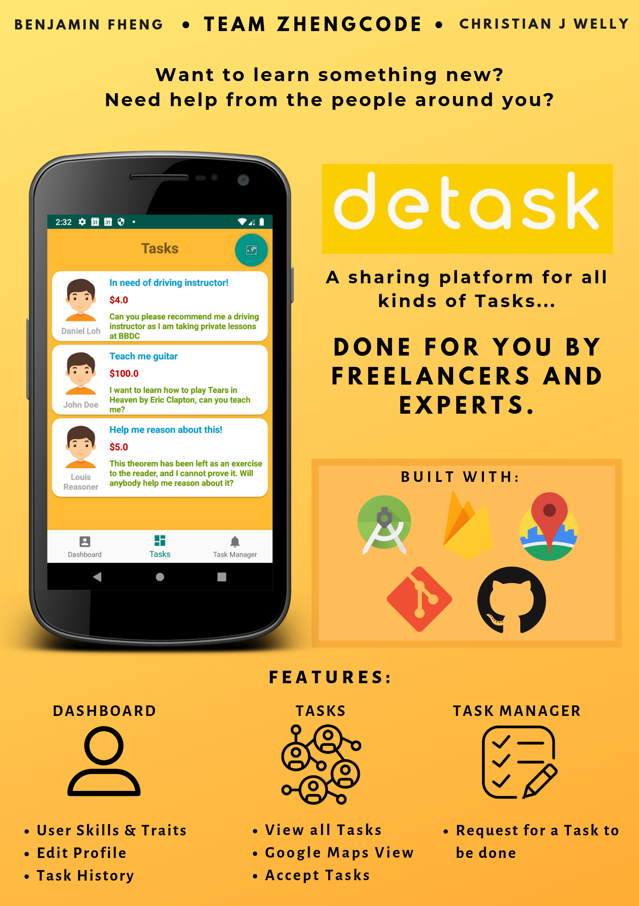

Have you ever wanted to learn something new, but struggle to find the right person to help you with it? Or perhaps you simply require help from someone around you? Enter *detask*, an Android application which helps you look for the right person for the task that you have! 

Be it finding a tutor for guitar, or delivering flowers for your girlfriend, *detask* has you covered! An all-in-one task managing app to request for your task to be completed by another freelancer/user, or earn incentives from doing other people’s tasks!

*detask* is a project built by Team ZhengCode (Fheng Guo Jing, Benjamin and Christian James Welly) for CP2106 (Orbital), a summer-long independent software engineering module. The project attained the highest level of achievement, [Apollo 11](https://orbital.comp.nus.edu.sg/?p=45), in the module. Our final submission report can be found [here](https://docs.google.com/document/d/1E9MDTBPoPHKJOVJNi6SsLq-xQj1mefgllzGYb93G5FU/edit?usp=drive_web&ouid=101062236602867497167).

 We currently do not push some keys, so you may not have full access to running the application after cloning the repository. However, if you are interested in the project, feel free to contact Benjamin at benfheng@gmail.com or Christian at chrisjwelly@gmail.com